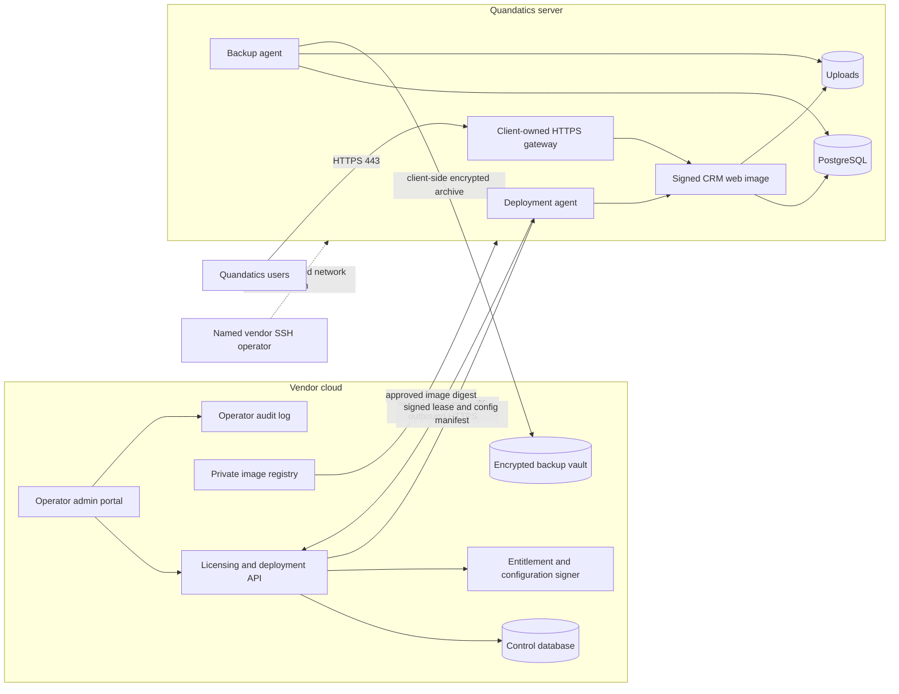

# Client-hosted subscription control plane

- **Date:** 2026-08-10
- **Status:** Approved design
- **First client:** Quandatics
- **Product model:** Vendor-managed subscription, client-hosted application and data

## 1. Decision

The vendor will run a central control plane in its cloud account. Quandatics will run the CRM, PostgreSQL, uploads, local backups, and ingress gateway on its own server. The vendor will distribute signed production images from a private registry and will not grant Quandatics access to the source repository.

The control plane will manage client accounts, deployments, contracts, invoices, seats, module entitlements, configuration versions, releases, and backup inventory. It will not receive live CRM records. A separate encrypted backup vault will retain client-approved disaster-recovery archives.

One standard product image will serve Quandatics and future clients. Signed runtime entitlements and signed configuration bundles will create each client's licensed and customised experience. The team will not maintain a permanent Quandatics source fork.

## 2. Terms and ownership

| Term | Meaning |
| --- | --- |
| Vendor | The user's software company, which sells and supports the subscription |
| Client | Quandatics for the first deployment; future customers use the same model |
| Control plane | Vendor-cloud admin portal, licensing API, configuration service, release metadata, and backup inventory |
| Data plane | The client-hosted CRM application, database, uploads, local backup service, and HTTPS gateway |
| Deployment | One installed client environment, such as Quandatics production |
| Organisation | A business entity inside one deployment |
| Entitlement lease | A short-lived signed statement of seats, modules, contract status, and operating dates |
| Configuration bundle | A signed declarative description of client-specific workflows and UI settings |

Quandatics owns its live CRM data. The vendor owns the product source, image release process, entitlement authority, and configuration publishing process. Quandatics may create any number of organisations inside its deployment. The subscription counts unique active people across the deployment, not organisations or memberships.

## 3. Current crm-v2 baseline and gaps

The current repository already supplies much of the client data plane:

- `docker-compose.yaml` runs PostgreSQL, a migrator, the Next.js web application, Caddy, local uploads, scheduled backups, and an optional database admin UI.
- `apps/web/db/sql/rls.sql` and the non-privileged `crm_app` role enforce tenant isolation.
- `apps/web/lib/subscription-licensing.ts` checks tenant subscription dates and seat limits.
- `apps/web/app/(app)/settings/subscription/` lets the local platform master issue seats and invoices.
- `apps/web/modules.config.ts` and `apps/web/lib/modules.ts` gate optional modules at build time.
- `ops/` creates local database, CSV, and upload backups.
- The staging and pull-request workflows provide isolated test environments.

The product model requires six changes:

1. Production hosts must pull signed images instead of cloning the private repository and building from source.
2. Commercial authority must move from the client database to the vendor control plane.
3. Seat counting must cover distinct active users across the deployment instead of active members inside one organisation.
4. Module gates must use signed runtime entitlements instead of a client-specific build configuration.
5. Quandatics workflow and UI changes must use signed declarative configuration instead of a source fork.
6. The local backup service must encrypt archives before it uploads them to the vendor backup vault.

## 4. System architecture

The licensing path and the support path stay separate. The control plane will not expose a remote shell or accept arbitrary commands for execution on a client server. Vendor operators will use their named SSH account for installation, approved upgrades, incident response, and restore work.

## 5. Vendor control plane

The first control plane will use Cloudflare Workers for the API and operator application, D1 for commercial and deployment metadata, and R2 for encrypted backup objects. The vendor will place the operator interface behind strong identity controls and will use application roles in addition to the identity gateway.

### 5.1 Operator functions

The portal will support:

- Client and deployment registration
- Contract dates, billing status, invoice records, plan, seat ceiling, and module entitlements
- Entitlement lease issuance, renewal, scheduled suspension, and key rotation
- Workflow and UI configuration drafts, validation, preview, approval, and publication
- Release channels, approved image digests, maintenance windows, and deployment status
- Heartbeat, application version, active unique-user count, and last backup status
- Restore requests, approval evidence, retention status, and deletion evidence
- An append-only audit record for each commercial, access, release, configuration, backup, and restore action

The control plane will store deployment metadata and encrypted backup inventory. It will not store leads, contacts, accounts, opportunities, quotations, finance documents, uploaded files in plaintext, passwords, or authentication sessions from a client data plane.

### 5.2 Operator roles

| Role | Authority |
| --- | --- |
| Vendor Owner | Manages clients, contracts, seats, modules, configuration publication, releases, operator access, and recovery policy |
| Vendor Support | Views deployment health and backup status, prepares configuration drafts, and performs approved maintenance |
| Release Manager | Approves signed release digests and maintenance windows |
| Billing Operator | Manages invoices, contract dates, and scheduled entitlement changes without server access |
| Auditor | Reads control-plane audit and recovery evidence |

The first deployment may assign all roles to one vendor owner account. The data model and permission checks must keep the roles separate so the vendor can add staff without redesigning authority.

The vendor owner account must use SSO or a passkey with MFA. The owner must store recovery material outside the control-plane account. Shared operator accounts and password-only master access are prohibited.

## 6. Deployment identity and protocol

### 6.1 Registration

1. The vendor owner creates a client deployment and a single-use installation token.
2. The deployment agent generates an Ed25519 identity key pair and canonical UUID key ID on the client server, then persists both before opening the registration request.
3. The agent sends the token, deployment metadata, precommitted key ID, and public key to the registration endpoint over HTTPS.
4. The control plane consumes the token once and binds the exact key ID and public-key fingerprint to the client and deployment. An identical retry returns that binding even after token expiry; any changed tuple is rejected.
5. The agent stores its private key in a root-owned volume with mode `0600`.

Each heartbeat includes a timestamp, nonce, body digest, and deployment signature. The control plane rejects reused nonces, stale timestamps, unknown key IDs, and invalid signatures. The agent pins the vendor entitlement-verification public key set.

### 6.2 Heartbeat payload

The agent sends:

- Deployment ID and environment
- Application version and current image digest
- Entitlement and configuration version IDs
- Distinct active-user count and reserved invitation count
- Enabled-module acknowledgement
- Health state, migration version, last successful backup time, and restore-test time
- Agent version and signed request metadata

The agent must not send business rows, names, email addresses, document contents, uploaded files, credentials, or database dumps through the heartbeat endpoint.

The agent will request a fresh lease every 15 minutes with jitter. A transient failure will not interrupt user requests because the web application verifies the cached signed lease locally.

## 7. Entitlement lease and remote subscription control

The control plane signs each entitlement lease with Ed25519. The payload includes:

- Schema version, key ID, lease ID, client ID, and deployment ID
- Issue time, lease expiry, contract start, contract end, and grace deadline
- Subscription status and plan
- Maximum unique active users
- Enabled module IDs and add-ons
- Configuration version
- Release channel, minimum supported application version, and optional approved digest

An annual or six-month contract does not produce a six-month lease. The control plane renews a short operational lease while the contract remains valid. A lease expires after 24 hours and allows a seven-day offline grace period. This bounds remote enforcement to eight days when a client blocks all licensing traffic, while ordinary heartbeats apply a signed status change sooner.

For non-payment, the vendor owner schedules non-renewal or suspension with an effective date. The client receives warnings during the grace window. After grace expires, the application permits login, viewing, export, backup, and licence repair, but blocks business writes. Renewal restores write access without a data migration.

The control plane cannot guarantee immediate deactivation on hardware that the client controls. A client administrator with root access can block network traffic, alter the system clock, or patch compiled code. Short leases, clock-rollback detection, image signatures, audit records, and the subscription contract provide practical enforcement. The product must not claim tamper-proof DRM.

The application must retain the greatest trusted server time it has observed. A clock rollback cannot extend a lease. An invalid signature, wrong deployment ID, unsupported schema version, or expired trust key causes the verifier to reject the new bundle and retain the last valid bundle until its own grace period ends.

## 8. Seats and organisations

One subscription permits any number of organisations. The seat engine counts one person once across all organisations in the deployment.

The database will calculate occupied seats from distinct global user IDs that have at least one active client membership. It will exclude vendor-support identities. A pending invitation reserves one seat until the invitation expires, unless its normalised email belongs to an active user in the deployment.

Quandatics Owner and Admin users may invite, deactivate, and assign roles within the signed ceiling. They cannot increase the ceiling or alter contract dates. The server must enforce the ceiling inside the same transaction that activates a user or reserves an invitation, so concurrent accepts cannot exceed the limit.

The control plane will refuse an immediate seat reduction below reported occupied seats. The vendor may schedule the reduction for a future date. Quandatics must deactivate enough users before that date. If usage still exceeds the new ceiling, the application blocks new invitations and activations, shows the overage to client admins, and follows the signed entitlement state. It does not delete users or audit history.

## 9. Runtime module entitlements

The release image will contain the standard product modules. The signed lease will enable the modules purchased by the client. Each gate must cover:

- Sidebar, command palette, dashboards, and links
- Routes and server components
- Server actions and REST API endpoints
- Background jobs and scheduled tasks
- Permission groups and role assignment
- Configuration fields that depend on a module

The database will keep one complete migration chain. A disabled module retains its tables and rows, matching the repository's existing disable-without-delete rule. Module dependencies remain code-defined and the application rejects an entitlement that enables a module without its dependencies.

This design replaces `apps/web/modules.config.ts` as the production entitlement source. Build-time flags may remain for development or image composition, but they cannot grant a client a commercial module. Server-side action gates must verify runtime entitlement even when the UI hides a feature.

## 10. Vendor-managed workflow and UI configuration

Quandatics administrators will not edit workflow or UI configuration. Vendor operators will manage it through the control plane.

The configuration schema will support:

- Theme tokens, logos, terminology, navigation visibility, and form layout
- Custom field definitions with stable codes, types, constraints, and module ownership
- Stage definitions, allowed transitions, required fields, and approval thresholds
- Role-based UI visibility, document templates, numbering, reminders, and notifications
- Client-specific capability flags for code that remains in the standard product image

The schema will allow declarative data. It will reject JavaScript, SQL, shell commands, arbitrary HTML, and unrestricted CSS. This rule prevents a configuration bundle from becoming remote code execution.

Operators will use this lifecycle:

1. Create a draft against a declared application and schema compatibility range.
2. Validate references, module dependencies, transition reachability, required-field rules, and permissions.
3. Preview the draft in a vendor staging environment with synthetic or authorised test data.
4. Record vendor approval and publish a signed immutable version.
5. Let the deployment agent fetch the manifest and bundle.
6. Let the application verify the signature and schema before an atomic activation.

The client stores the last-known-good configuration. If validation or activation fails, the application keeps that version and reports the failure. A rollback publishes the chosen previous version as a new signed activation; operators do not edit history.

Developers will implement bespoke Quandatics features in the private mainline behind a registered capability flag. They will not create a long-lived client branch. The vendor can later offer the capability to another client through entitlements.

## 11. Source distribution and release process

Quandatics will receive deployment manifests and signed production images. It will not receive the Git repository, TypeScript source, tests, internal documentation, build credentials, or Git history.

The CI release pipeline will:

1. Run lint, type checks, tests, production build, dependency audit, secret scan, and image scan.
2. Produce minimal web, migrator, and deployment-agent images without browser source maps or development dependencies.
3. Generate an SBOM and attach release provenance.
4. Push images to a private OCI registry.
5. Sign each immutable image digest with Cosign through the CI workload identity.
6. Publish a signed release manifest to the control plane.

Quandatics will receive a per-client pull-only registry credential. Operators will deploy image digests instead of mutable tags. A Docker image contains compiled runtime files that a server administrator can extract. The contract must describe this as licensed object-code delivery rather than source-code delivery or anti-reverse-engineering protection.

The current production process builds from a source checkout on the client server. The new process must replace that checkout with a deployment directory that contains only Compose manifests, environment secrets, proxy configuration, and approved operational scripts.

### 11.1 Scheduled upgrade

1. CI builds, tests, scans, signs, and publishes the release.
2. The vendor validates it in PR preview and vendor staging environments.
3. The vendor and Quandatics approve a maintenance window.
4. The support operator checks backup freshness and creates a verified pre-deploy recovery point.
5. The server pulls the named digest and verifies its signature and release identity.
6. The migrator applies backward-compatible migrations.
7. The operator starts the web and agent, then checks health, authentication, licensing, enabled modules, and a client-approved smoke path.
8. The operator records the outcome in the control plane.

Failed pulls or signature checks leave the running release untouched. Schema changes must use expand-and-contract migrations. The team will separate destructive cleanup from the release that stops using the old schema, which preserves a forward-fix and rollback window.

## 12. Access and support

Quandatics will grant the vendor a permanent named server account that authenticates with an individual SSH key. The client will disable direct root login and shared passwords. A narrow sudo policy will cover Docker, deployment directories, logs, backup commands, and approved network diagnostics. The host or access gateway will record authentication and privilege use.

Permanent server access does not grant standing application-level access to business records. The local vendor-support identity will manage licence diagnostics, configuration status, release health, and backup status without consuming a seat. Work that requires viewing client records must use a time-bounded support grant approved and audited by Quandatics.

The client can revoke the SSH account without breaking licensing. The vendor can revoke a deployment identity without using SSH. The two controls remain independent.

## 13. Encrypted off-site backup

The existing backup service will continue to produce local PostgreSQL and upload archives. Before upload, the client server will:

1. Create a consistent database dump and upload archive.
2. Compress the archive.
3. Encrypt it with a unique per-client recovery public key.
4. Generate a cryptographic checksum and a signed manifest that records deployment, application version, schema version, size, and creation time.
5. Upload the encrypted object and manifest over outbound HTTPS.
6. Confirm remote checksum and retention status before it reports success.

The vendor will keep the recovery private key in its secrets vault, separate from R2 credentials. Quandatics will receive a sealed escrow copy so it can recover data if the vendor becomes unavailable. The vendor will use a separate bucket or strict client prefix and access policy for each client.

The approved default policy retains daily recovery points for 35 days and monthly recovery points for 12 months. R2 bucket locks will prevent overwrite or deletion during the contracted retention period. Lifecycle rules will expire objects after retention. The contract must explain that an active retention lock can delay an end-of-contract deletion until the lock expires.

An automated job will verify archive and manifest checksums after each upload. Once per month, an approved job will download a recovery point to an isolated environment on the client server, decrypt it, restore it into a temporary database and upload volume, run integrity checks, record the result, and remove the temporary plaintext copy.

The vendor will restore a client backup only after a recorded Quandatics approval or under a contract-defined disaster procedure. The audit log will capture the operator, reason, object IDs, timestamps, destination, result, and deletion of temporary plaintext data.

## 14. Failure behaviour

| Failure | Required behaviour |
| --- | --- |
| Control plane or network unavailable | Use the last signed lease through its seven-day grace period; warn operators; do not block requests during each heartbeat attempt |
| Deployment agent unavailable | Web application uses its cached verified bundle; health monitoring alerts both parties |
| Invalid lease or configuration signature | Reject the new bundle, audit the reason, and retain the last valid bundle until its own deadline |
| Configuration incompatible with app version | Refuse activation and report the required version; keep the last-known-good configuration |
| Seat ceiling reached | Block invitation reservation or activation in the transaction; retain existing users and records |
| Subscription grace elapsed | Enter read-only mode while preserving login, view, export, backup, and licence recovery |
| Backup upload fails | Keep the local encrypted archive, alert, retry with backoff, and report the backup as failed |
| Image signature or digest check fails | Do not deploy; keep the current containers running |
| Migration or post-deploy health check fails | Stop the rollout, retain logs and evidence, and follow the release recovery runbook |
| Vendor cloud loss | Client operates through cached grace; local data and local backups remain available; escrow material supports recovery |

No failure path may delete CRM data, silently disable backups, report an unverified backup as successful, or execute a remote arbitrary command.

## 15. Control-plane records and APIs

### 15.1 Core records

- `clients`
- `deployments`
- `deployment_keys`
- `contracts`
- `invoices`
- `plans` and `module_catalog`
- `entitlement_versions`
- `configuration_versions`
- `release_versions`
- `heartbeat_rollups`
- `backup_inventory`
- `restore_requests`
- `operator_users`, `operator_roles`, and `operator_audit_log`

The control database will hold metadata. R2 will hold encrypted backup objects. The private OCI registry will hold signed images and attached SBOM/provenance artifacts.

### 15.2 Protocol surface

- `POST /v1/deployments/register` consumes a single-use install token and binds the deployment public key.
- `POST /v1/deployments/{id}/heartbeat` accepts signed health and usage metadata and returns current signed manifest references.
- `GET /v1/deployments/{id}/entitlement/{version}` returns an immutable signed lease.
- `GET /v1/deployments/{id}/configuration/{version}` returns an immutable signed configuration bundle.
- `POST /v1/deployments/{id}/backups` registers an uploaded encrypted object and integrity manifest.
- `POST /v1/restore-requests` records an approved recovery operation.

Operator endpoints use operator identity and RBAC. Deployment endpoints use deployment signatures. Backup upload credentials allow writes only to the assigned client path and cannot read or delete retained objects.

## 16. Security controls

- Separate operator, deployment, registry, backup-write, and backup-recovery credentials.
- Store secrets outside images and Compose files committed to version control.
- Use TLS for all cross-boundary traffic.
- Sign entitlement and configuration payloads with rotating Ed25519 keys and include key IDs.
- Sign OCI image digests and verify the expected CI identity before deployment.
- Rate-limit registration and heartbeat endpoints; reject replayed requests.
- Record operator and support actions in append-only audit storage.
- Keep database RLS and the non-privileged application role in the client data plane.
- Scan runtime images for source maps, repository metadata, secrets, and development files.
- Test backup encryption, retention, restore, and deletion against contract policy.

The vendor acts as a data processor when it stores client backups. The service agreement must cover processing purpose, security measures, retention, restore authority, incident notification, sub-processors, storage location, and deletion evidence. The vendor must confirm the final wording and any cross-border requirements with qualified Malaysian counsel before production use.

## 17. Verification

### 17.1 Unit tests

- Entitlement canonicalisation, signing, verification, key rotation, time windows, and rollback-clock detection
- Distinct-user seat counting across organisations and invitation reservation
- Module dependency and server-action gates
- Workflow schema validation, transition reachability, and last-known-good selection
- Read-only mutation guard and permitted recovery operations

### 17.2 Integration tests

- Single-use registration, signed heartbeat, nonce replay rejection, identity rotation, and revocation
- Contract renewal, non-renewal, scheduled suspension, grace, read-only, and recovery
- Concurrent invitation acceptance at the seat ceiling
- Configuration publish, incompatible bundle rejection, activation, and rollback
- Image digest and signature verification
- Encrypted backup upload, checksum verification, retention, restore drill, and temporary plaintext cleanup

### 17.3 End-to-end and security tests

- Quandatics Admin manages users within the ceiling but cannot change entitlement.
- A user who belongs to several organisations consumes one seat.
- Disabled modules disappear from navigation and reject direct route, action, API, and job access.
- The application keeps working during a control-plane outage, enters warnings, becomes read-only after grace, and recovers after renewal.
- A tampered lease, configuration bundle, image, clock, or backup manifest fails closed without damaging client data.
- Tenant RLS continues to isolate organisations inside the client deployment.
- Runtime images contain no source maps, Git metadata, secrets, tests, or original TypeScript source.

## 18. Delivery phases

The design spans distinct systems. Each phase needs its own implementation plan and release gate.

1. **Signed image distribution:** build and sign minimal images in CI, create the source-free deployment bundle, and stop building from a Git checkout on the client server.
2. **Control-plane foundation:** operator identity, client/deployment records, contracts, invoices, module catalog, audit, and deployment registration.
3. **Lease and local enforcement:** deployment agent, signed heartbeat, short leases, distinct-user seats, runtime module gates, grace, and read-only mode.
4. **Configuration platform:** schema, control-plane authoring, validation, preview, signing, client activation, and rollback.
5. **Encrypted backup vault:** client-side encryption, R2 upload, retention locks, inventory, alerts, and restore drills.
6. **Quandatics production migration:** issue deployment identity, migrate existing subscription records, deploy signed images, verify backup recovery, and complete acceptance testing.

The team should start with phase 1 because the current on-server source checkout conflicts with the approved source-distribution boundary. Phase 2 follows before the product moves commercial authority out of the client database.

## 19. Non-goals and limits

- The control plane will not proxy normal CRM requests or query the live client database.
- The control plane will not provide arbitrary remote command execution.
- Quandatics will not receive source-repository access.
- Quandatics administrators will not edit workflow or UI configuration.
- The product will not maintain a Quandatics-specific source fork.
- The licence will not count organisations or count one person twice for several memberships.
- Subscription expiry will not delete records or prevent export and backup.
- The system cannot prevent a root administrator from inspecting compiled runtime files or attempting to bypass local checks.
- Technical enforcement supplements the subscription agreement; it does not replace it.

## 20. References

- [Cloudflare D1](https://developers.cloudflare.com/d1/)
- [Cloudflare Workers secrets](https://developers.cloudflare.com/workers/configuration/secrets/)
- [Cloudflare R2 data security](https://developers.cloudflare.com/r2/reference/data-security/)
- [Cloudflare R2 bucket locks](https://developers.cloudflare.com/r2/buckets/bucket-locks/)
- [Cloudflare R2 lifecycle rules](https://developers.cloudflare.com/r2/buckets/object-lifecycles/)
- [GitHub Container Registry](https://docs.github.com/en/packages/working-with-a-github-packages-registry/working-with-the-container-registry)
- [Sigstore Cosign container signing](https://docs.sigstore.dev/cosign/signing/signing_with_containers/)
- [Malaysia Personal Data Protection Principles](https://www.pdp.gov.my/ppdpv1/en/principles-of-personal-data-protection/)
- [Malaysia Data Protection by Design Guideline](https://www.pdp.gov.my/ppdpv1/wp-content/uploads/2026/04/Data-Protection-By-Design-Guideline-DpbD.pdf)
