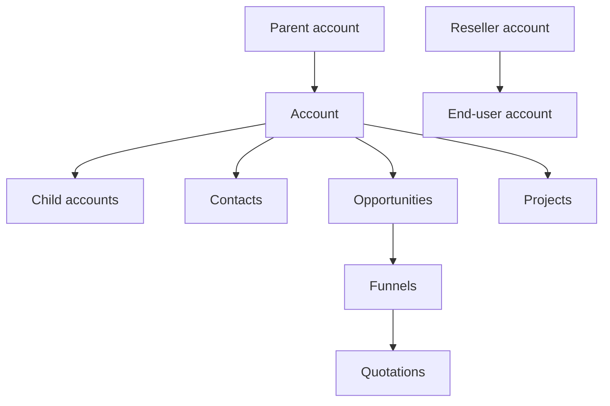

| Attribute | Value |
| --- | --- |
| Availability | Core |
| Route | `/accounts`, `/accounts/[id]` |
| Main table | `accounts` |
| Permissions | `account.view`, `account.create`, `account.update`, `account.delete` |
| Primary code | `app/(app)/accounts/`, `db/schema/crm.ts` |

## Purpose

An account is a customer, prospect, reseller, end user, or related organization.
It becomes the stable parent for people, opportunities, funnels, quotations,
projects, and selected finance context.

## Relationship model

Account hierarchy is cycle-protected. Tenant-safe composite foreign keys prevent
records from linking to an account in another tenant.

## Responsibilities

- Hold organization identity, registration, industry, address, website, and
  ownership.
- Distinguish prospect/customer lifecycle from channel type.
- Model parent/child organizations and reseller/end-user relationships.
- Surface related contacts, opportunities, funnels, quotations, projects,
  activity, and documents.
- Become a customer automatically when its funnel reaches Won.

## Code map

| Layer | Location |
| --- | --- |
| List and detail UI | `apps/web/app/(app)/accounts/` |
| Server actions and duplicate search | `apps/web/app/(app)/accounts/actions.ts` |
| Schema | `apps/web/db/schema/crm.ts` |
| Ownership cascade | `apps/web/server/services/owner-cascade.ts` |
| API | `GET /api/v1/accounts`, `GET /api/v1/accounts/{id}` |

## Extension rule

Put organization-level facts here. Put named individuals in Contacts, pursuit
facts in Opportunities or Funnel, and transaction snapshots in Quotations,
Projects, Sales Orders, or Finance.
