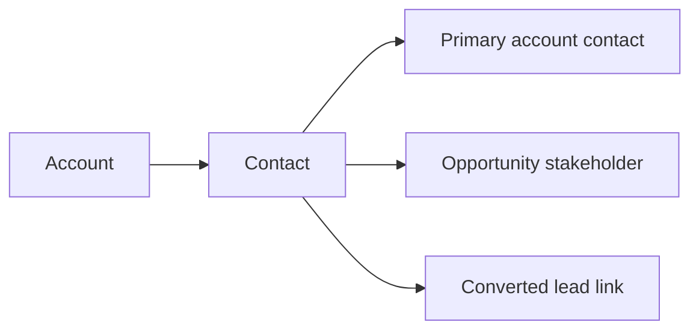

| Attribute | Value |
| --- | --- |
| Availability | Core |
| Route | `/persons`, `/persons/[id]` |
| Main table | `persons` |
| Permissions | `person.view`, `person.create`, `person.update`, `person.delete` |
| Primary code | `app/(app)/persons/`, `db/schema/crm.ts` |

## Purpose

The UI calls this capability **Contacts** while the route and schema use
`persons`. Every contact belongs to exactly one account and may act as its
primary contact or participate in an opportunity as a budget owner, sponsor, or
other stakeholder.

## Relationships

## Responsibilities

- Store a person's name, title, email, phone, country, owner, and account.
- Maintain one primary-contact choice for an account.
- Support contact selection throughout opportunities and lead conversion.
- Enforce tenant and account ownership on create or reassignment.
- Soft-delete and restore contacts without losing related history.

## Code map

| Layer | Location |
| --- | --- |
| List and detail UI | `apps/web/app/(app)/persons/` |
| Server actions | `apps/web/app/(app)/persons/actions.ts` |
| Schema | `apps/web/db/schema/crm.ts` |
| Conversion source | `apps/web/server/services/conversion.ts` |
| API | `GET /api/v1/persons`, `GET /api/v1/persons/{id}` |

## Naming rule

Use **Contact** in user-facing language. Use `person` only when referring to the
existing route, permission key, or database table.
