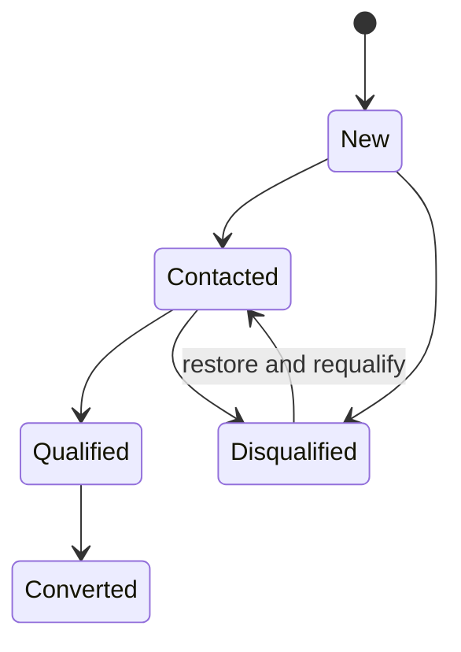

| Attribute | Value |
| --- | --- |
| Availability | Core |
| Route | `/leads`, `/leads/[id]`, `/leads/[id]/convert` |
| Main table | `leads` |
| Permissions | `lead.view`, `lead.create`, `lead.update`, `lead.delete`, `lead.convert` |
| Primary code | `app/(app)/leads/`, `server/services/conversion.ts`, `db/schema/crm.ts` |

## Purpose

A lead is raw inbound interest that has not yet become a durable customer
relationship or sales pursuit. It records identity, company, source, owner,
contact details, pipeline position, and conversion outcomes.

## Lifecycle

Conversion creates or links an Account, creates or links a Contact, and creates
the initial sales pursuit. The lead retains links to all converted records and
records the conversion timestamp.

## Responsibilities

- Capture new interest and assign an owner.
- Track status and optional pipeline stage.
- Record a structured disqualification reason.
- Detect and review similar accounts before conversion.
- Convert once, without duplicating downstream records.
- Preserve deletion and restoration history through soft delete.

## Code map

| Layer | Location |
| --- | --- |
| List, detail, conversion UI | `apps/web/app/(app)/leads/` |
| Server actions | `apps/web/app/(app)/leads/actions.ts` |
| Conversion transaction | `apps/web/server/services/conversion.ts` |
| Schema | `apps/web/db/schema/crm.ts` |
| API | `GET /api/v1/leads`, `GET /api/v1/leads/{id}` |

## Connected modules

Accounts and Contacts receive converted identity data. Opportunities and Funnel
receive the sales pursuit. Activities and standardized change tracking record
subsequent edits.

## Extension rule

Add fields to the lead only when they describe pre-conversion interest. Data
that belongs to a durable organization, person, or sales pursuit should live in
Accounts, Contacts, or Opportunities and be mapped during conversion.
