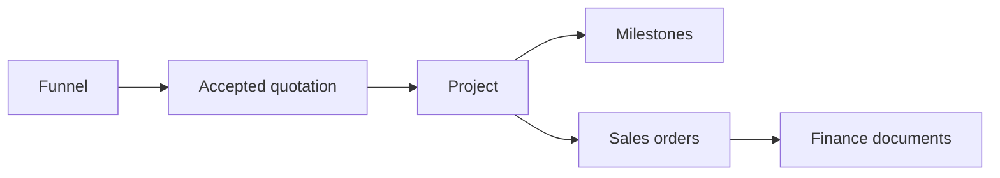

| Attribute | Value |
| --- | --- |
| Availability | Optional plugin |
| Flag | `projects` |
| Route | `/projects`, `/projects/[id]`, `/projects/new` |
| Main tables | `projects`, `project_counters` |
| Permissions | `project.view`, `project.create`, `project.update`, `project.delete` |
| Primary code | `app/(app)/projects/`, `db/schema/projects.ts` |

## Purpose

A Project is the delivery record for sold work. It connects the Account,
Funnel, accepted Quotation, milestones, Sales Orders, Finance documents, and
optional intercompany delivery context.

## Responsibilities

- Generate or accept a stable project code.
- Snapshot Account, project nature, currency, value, Funnel, and Quotation.
- Track planning, active, on-hold, completed, or cancelled status.
- Own delivery notes, owner, start date, and project-level milestones.
- Reconcile milestone allocation with project value.
- Expose downstream Sales Order and Finance context when enabled.

Project codes use a tenant/year-scoped counter and the pattern
`YEAR-ENTITY-ACCOUNT-NATURE-NNN`.

## Dependencies

Projects has no plugin dependency. Sales Orders depends on Projects. Finance
depends on both Projects and Sales Orders.

## Code map

| Layer | Location |
| --- | --- |
| UI and actions | `apps/web/app/(app)/projects/` |
| Numbering | `apps/web/server/services/numbering.ts` |
| Completion rules | `apps/web/server/services/finance.ts` |
| Schema | `apps/web/db/schema/projects.ts` |
| Plugin guards | `apps/web/lib/module-guard.ts`, `apps/web/lib/actions.ts` |
