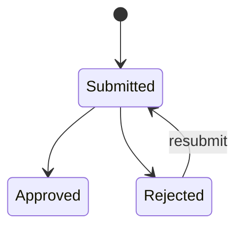
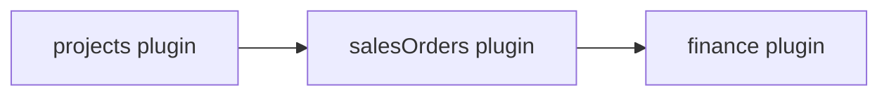

| Attribute | Value |
| --- | --- |
| Availability | Optional plugin |
| Flag | `salesOrders` |
| Depends on | `projects` |
| Route | `/sales-orders`, `/sales-orders/[id]` |
| Main table | `sales_orders` |
| Permissions | `sales_order.view`, `sales_order.submit`, `sales_order.approve` |
| Primary code | `app/(app)/sales-orders/`, `db/schema/sales-orders.ts` |

## Purpose

A Sales Order records the controlled handoff from accepted commercial work into
an approved order that Finance can use as the root of the O2C document chain.
The user submits supporting customer evidence against a Project.

The official SO number is issued only on approval. Rejection records its reason
and allows a corrected submission.

## Responsibilities

- Attach to one Project.
- Store supporting document kind, payment term, notes, and attachments.
- Record submitter, reviewer, decision, and timestamps.
- Generate a tenant-scoped order number on approval.
- Provide the approved root anchor required by Finance.

## Dependencies

## Code map

| Layer | Location |
| --- | --- |
| UI and actions | `apps/web/app/(app)/sales-orders/` |
| Numbering | `apps/web/server/services/numbering.ts` |
| Schema | `apps/web/db/schema/sales-orders.ts` |
| Attachments | `apps/web/components/attachments/`, `apps/web/app/api/files/` |
