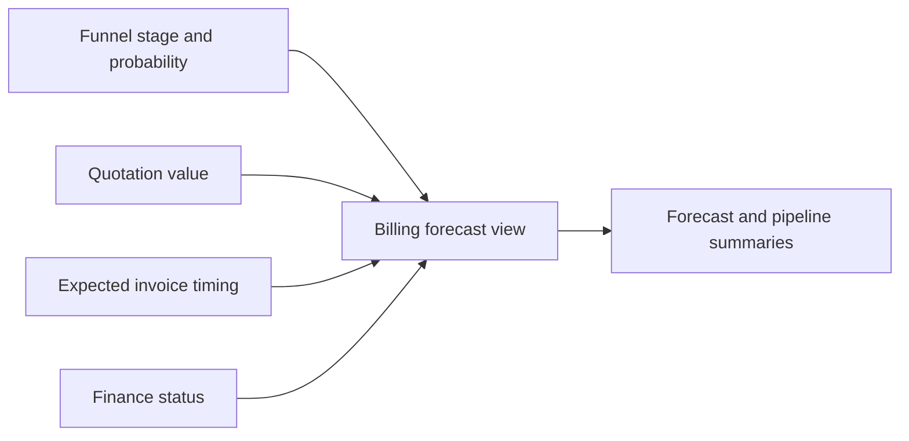

| Attribute | Value |
| --- | --- |
| Availability | Optional plugin |
| Flag | `forecast` |
| Dependencies | None |
| Route | `/forecast` |
| Primary data | `billing_forecast` view plus pipeline aggregates |
| Permission | `forecast.view` |
| Primary code | `app/(app)/forecast/`, `db/sql/views.sql` |

## Purpose

Forecast is a read-only reporting surface. It combines sales probability,
expected billing, tax treatment, milestone timing, and selected intercompany
context without owning transaction records.

## Responsibilities

- Present probability-weighted, net-of-tax expected billing.
- Group pipeline value by stage and currency.
- Respect each stage's `includeInForecast` setting.
- Include intercompany details only when Finance is enabled and the user has
  permission.
- Remain report-only; source corrections happen in the owning module.

## Why it has no hard Finance dependency

The forecast can operate on sales and milestone data when Finance is disabled.
Finance enriches the report but is not required for it to boot.

## Code map

| Layer | Location |
| --- | --- |
| UI and queries | `apps/web/app/(app)/forecast/` |
| SQL view | `apps/web/db/sql/views.sql` |
| View installation | `apps/web/db/migrate.ts` |
| Settings input | Funnel stage forecast flags |
