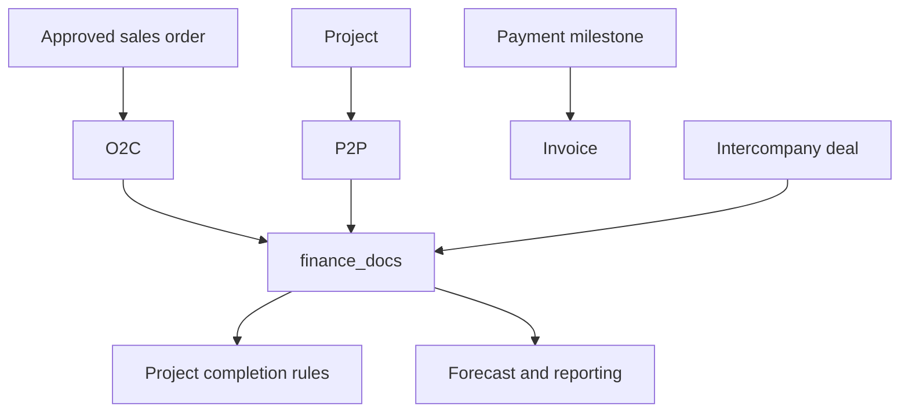

| Attribute | Value |
| --- | --- |
| Availability | Optional plugin |
| Flag | `finance` |
| Depends on | `projects`, `salesOrders` |
| Routes | `/billing`, `/purchasing`, `/intercompany` |
| Main tables | `finance_docs`, `intercompany_*` |
| Permissions | `finance.view`, `finance.manage`, `intercompany.view` |

## Scope

The Finance plugin supplies three business capabilities:

1. [Order to cash](/product/finance/order-to-cash)
2. [Procure to pay](/product/finance/procure-to-pay)
3. [Intercompany](/product/finance/intercompany)

They are separate workflows in the docs but share one plugin flag, one finance
document table, common numbering, statuses, and permissions.

## Shared document model

All finance documents use:

- Kind: delivery order, invoice, credit note, receipt, RFQ, purchase order,
  purchase invoice, or payment.
- Status: draft, issued, settled, or cancelled.
- Tenant-scoped document number.
- Optional parent document, Sales Order, Project, milestone, and intercompany
  links.
- Party, amount, currency, dates, notes, and reminder state.

The document chain lives in `parent_id`; valid parent/child combinations live in
`lib/finance-kinds.ts`.

## Dependency rule

Finance cannot be enabled unless Projects and Sales Orders are enabled. The
application validates this at boot and refuses invalid configuration.

## Code map

| Layer | Location |
| --- | --- |
| Billing and shared actions | `apps/web/app/(app)/billing/` |
| Purchasing view | `apps/web/app/(app)/purchasing/` |
| Intercompany | `apps/web/app/(app)/intercompany/` |
| Document rules | `apps/web/lib/finance-kinds.ts` |
| Business services | `apps/web/server/services/finance.ts`, `intercompany.ts` |
| Schema | `apps/web/db/schema/finance.ts`, `intercompany.ts` |
