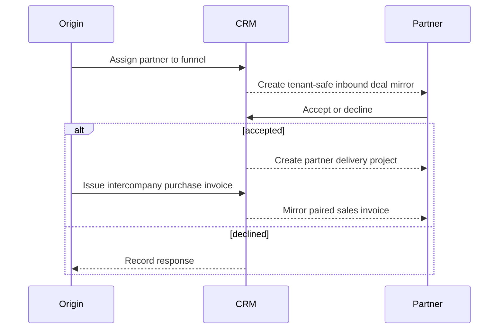

| Attribute | Value |
| --- | --- |
| Type | Capability inside the Finance plugin |
| Flag | `finance` |
| Route | `/intercompany` |
| Main tables | `intercompany_deals`, `intercompany_deal_parties`, `intercompany_deal_responses`, `finance_docs` |
| Permissions | `intercompany.view`, `finance.view`, `finance.manage` |

## Purpose

Intercompany supports work shared between two CRM entities without letting one
tenant read the other's full opportunity or customer data.

## Isolation model

- A compact intercompany mirror carries only the information the partner needs.
- Cross-tenant references are deliberate and protected by two-sided RLS rules.
- Counterpart document number is denormalized because RLS blocks arbitrary
  cross-tenant joins.
- Each paired finance document links to its counterpart and intercompany deal.

## Code map

| Layer | Location |
| --- | --- |
| Inbound UI and actions | `apps/web/app/(app)/intercompany/` |
| Funnel integration | `apps/web/app/(app)/funnel/actions.ts` |
| Mirror service | `apps/web/server/services/intercompany.ts` |
| Value callbacks | `apps/web/server/services/value.ts` |
| Schema | `apps/web/db/schema/intercompany.ts`, `finance.ts` |
| Tests | `apps/web/tests/interco-share.test.ts` |

## Plugin boundary

Intercompany has its own permission because its audience differs, but it shares
the Finance feature flag and document model. Split it into a separate plugin
only if it needs independent deployment and ownership.
