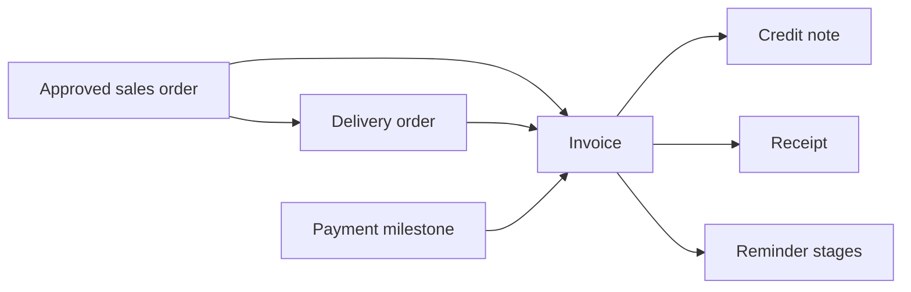

| Attribute | Value |
| --- | --- |
| Type | Capability inside the Finance plugin |
| Flag | `finance` |
| Route | `/billing`, `/billing/[id]` |
| Main table | `finance_docs` |
| Document kinds | `delivery_order`, `invoice`, `credit_note`, `receipt` |
| Permissions | `finance.view`, `finance.manage` |

## Purpose

O2C turns an approved Sales Order and Project into customer-facing delivery and
cash-collection documents.

## Rules

- The approved Sales Order is the root commercial anchor.
- An invoice may link directly to a Payment Milestone.
- Only one non-cancelled invoice can exist per milestone.
- Issuing the invoice changes the milestone to Invoiced.
- Settling through a receipt changes the milestone to Paid.
- Credit notes and receipts point to their upstream document.
- Reminder logging increments stage and records the latest reminder time.
- Project completion is evaluated through the framework-free finance service.

## Code map

| Layer | Location |
| --- | --- |
| Billing UI and actions | `apps/web/app/(app)/billing/` |
| Document-kind rules | `apps/web/lib/finance-kinds.ts` |
| Completion service | `apps/web/server/services/finance.ts` |
| Numbering | `apps/web/server/services/numbering.ts` |
| Schema | `apps/web/db/schema/finance.ts` |
| Tests | `apps/web/tests/finance-kinds.test.ts`, `reminders.test.ts` |

## Boundary rule

Payment Milestones express the expected schedule. O2C records the actual
invoice and receipt documents that satisfy it.
