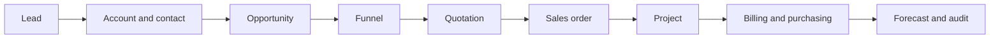

Quandatics CRM is one multitenant operating system for a services business. It
connects customer acquisition, selling, delivery, finance, reporting, and
governance without splitting their shared data or permission model across
separate applications.

## The operating lifecycle

- **CRM** establishes who the customer is and who owns the relationship.
- **Sales** manages the pursuit, stage movement, approval, offer, and expected
  payment plan.
- **Delivery** turns won work into an accountable project and approved order.
- **Finance** records O2C, P2P, and intercompany documents.
- **Platform** supplies tenancy, permissions, settings, audit, API access, and
  documentation across every domain.

## Core and optional capabilities

Core capabilities always exist. Optional plugins are deployment-wide feature
switches in `apps/web/modules.config.ts`.

| Type | Meaning |
| --- | --- |
| **Core** | Always available; access is still controlled by permissions. |
| **Optional plugin** | Routes, actions, navigation, and permission UI are hidden until its flag is enabled. |
| **Plugin capability** | A workflow inside a larger plugin, such as O2C inside Finance. It does not have an independent flag. |
| **Cross-cutting service** | Shared behavior such as activity history, attachments, numbering, or change tracking. |

Turning a plugin off never removes its tables, migrations, RLS policies, or
rows. The contract is **disable access, retain data**.

## Read the docs in two directions

### Follow the business

Start with the [customer lifecycle](/product/lifecycle), then open a product
module to learn its users, workflow, records, permissions, dependencies, and
source map.

### Follow the code

Start with the [codebase overview](/codebase/overview), then read the
[plugin system](/extensibility/overview) and
[adding a module](/extensibility/adding-a-module).

The [module directory](/product/module-directory) joins both views.
