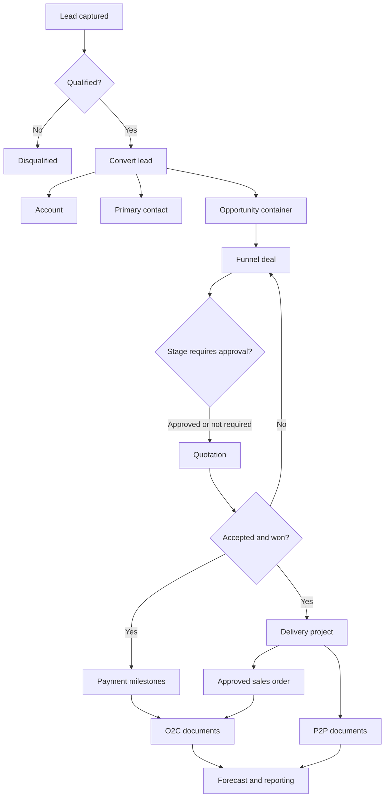

The lifecycle is the safest way to understand the CRM. Folder names and tables
make more sense once the business handoffs are clear.

## Handoffs

| From | To | What carries forward |
| --- | --- | --- |
| Lead | Account, contact, opportunity | Identity, company, owner, contact details, and conversion links. |
| Opportunity | Funnel | Account, owner, PPVVC analysis, project nature, budget, and pursuit context. |
| Funnel | Quotation | Customer, currency, nature, products or services, and commercial context. |
| Accepted quotation | Project | Account, funnel, accepted quote, value, currency, and project nature. |
| Project | Sales order | Delivery context and the supporting customer order document. |
| Sales order or milestone | Finance | Root order, project, milestone, party, amount, currency, and document chain. |
| Finance | Forecast and audit | Expected or realized value, due dates, statuses, and immutable change history. |

## Cross-cutting controls

- Tenant scope and PostgreSQL RLS isolate every organization.
- Permissions decide what a member can see or change.
- Ownership and manager hierarchy narrow record access.
- Stage gates and approval requests control sales progression.
- Module flags control deployment-wide availability, never data existence.
- Activity and audit records explain who changed what and when.
