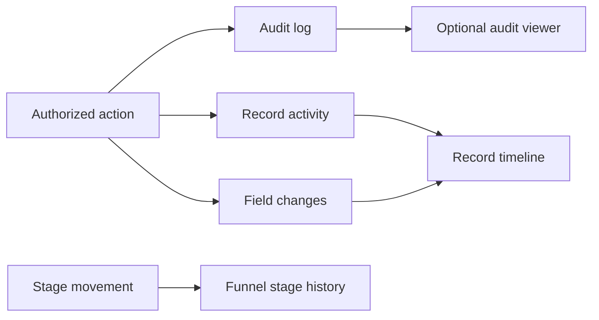

| Attribute | Value |
| --- | --- |
| Recording | Core and always on |
| Viewer | Optional `audit` plugin |
| Route | `/audit` |
| Main tables | `audit_log`, `activities`, `funnel_stage_history` |
| Permission | `audit.view` for the viewer |
| Primary code | `app/(app)/audit/`, `server/services/activity.ts`, `server/services/changes/` |

## Three histories

| Layer | Answers |
| --- | --- |
| Audit log | Who performed a security or system-significant operation? |
| Record activity | What happened on this business record? |
| Standardized changes | Which human-readable fields changed from what to what? |

The optional flag hides the consolidated Audit viewer. It does not stop audit,
activity, or change records from being written.

## Code map

| Layer | Location |
| --- | --- |
| Viewer | `apps/web/app/(app)/audit/` |
| Activity service | `apps/web/server/services/activity.ts` |
| Change registry and formatters | `apps/web/server/services/changes/` |
| Audit schema | `apps/web/db/schema/system.ts` |
| Activity schema | `apps/web/db/schema/activities.ts` |
| Stage history | `apps/web/db/schema/pipeline.ts` |
| Tests | `apps/web/tests/change-tracking.test.ts` |

## Extension rule

Register a new record type in standardized change tracking when it gains
editable business fields. Resolve foreign keys to human labels before presenting
them to users.
