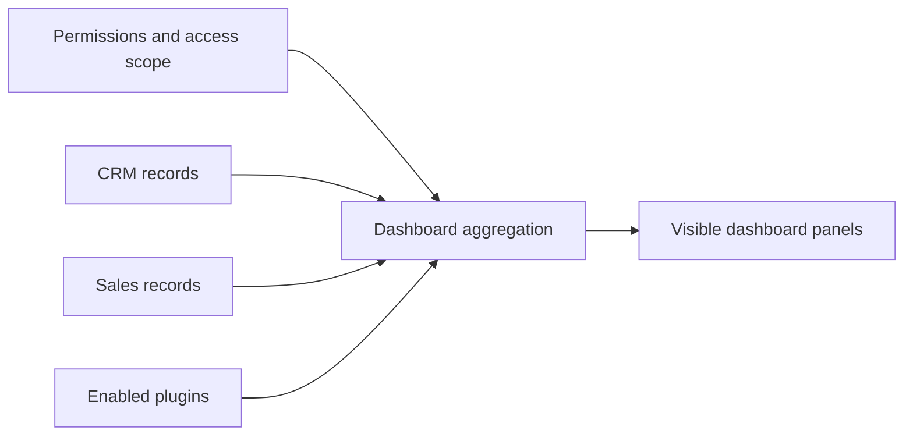

| Attribute | Value |
| --- | --- |
| Availability | Core |
| Route | `/dashboard` |
| Main data | Aggregates from CRM, Funnel, Quotations, Tasks, and optional Finance |
| Permissions | Each panel respects its owning module permission |
| Primary code | `app/(app)/dashboard/` |

## Purpose

The Dashboard is an orientation and action surface, not a data owner. It
summarizes the records a user is allowed to see and removes panels whose plugin
or permission is unavailable.

## Responsibilities

- Show recent Leads, Accounts, Funnels, and related work.
- Summarize pipeline value and stage distribution.
- Surface tasks and activity.
- Include Finance summaries only when Finance is enabled and permitted.
- Respect tenant, permission, ownership, and managed-subtree scope.

## Data flow

## Code map

| Layer | Location |
| --- | --- |
| Page and widgets | `apps/web/app/(app)/dashboard/` |
| Aggregation | `apps/web/app/(app)/dashboard/actions.ts` |
| Access scope | `apps/web/lib/access-scope.ts` |
| Navigation shell | `apps/web/components/app-sidebar.tsx` |

## Extension rule

A new module may contribute a dashboard summary only behind its module and
permission checks. The Dashboard must not become the module's business-logic
owner.
