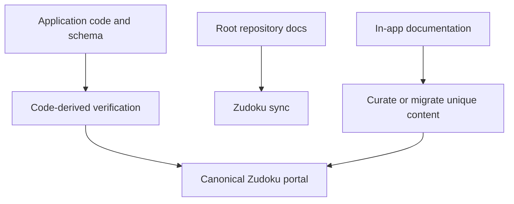

| Attribute | Value |
| --- | --- |
| Availability | Optional plugin |
| Flag | `documentation` |
| Route | `/documentation`, `/documentation/[slug]` |
| Permission | `docs.view` |
| Primary code | `apps/web/app/documentation/` |

## Purpose

The application contains a permission-gated documentation viewer with product,
finance, schema, settings, access-control, operations, and changelog material.
It is deliberately hidden from the main navigation.

The Zudoku portal is now the canonical broad directory because it provides
search, API reference, lifecycle navigation, and public-safe developer and
operator documentation.

## Source relationship

## Current in-app content

- Platform overview and lead-to-cash.
- CRM core, funnel forecast, quotations, and projects.
- Finance and intercompany.
- Access control, settings, generated schema reference, operations, and
  changelog.

## Consolidation rule

Do not maintain two hand-written explanations of the same behavior. New product
documentation belongs in Zudoku. In-app content should either link to the
canonical page or be migrated when authenticated/offline access requires it.

## Code map

| Layer | Location |
| --- | --- |
| Registry and navigation | `apps/web/app/documentation/registry.tsx` |
| Product content | `content-overview.tsx`, `content-sales.tsx`, `content-finance.tsx` |
| Reference content | `content-reference.tsx`, `schema-data.ts` |
| Route guard | `apps/web/app/documentation/layout.tsx` |
