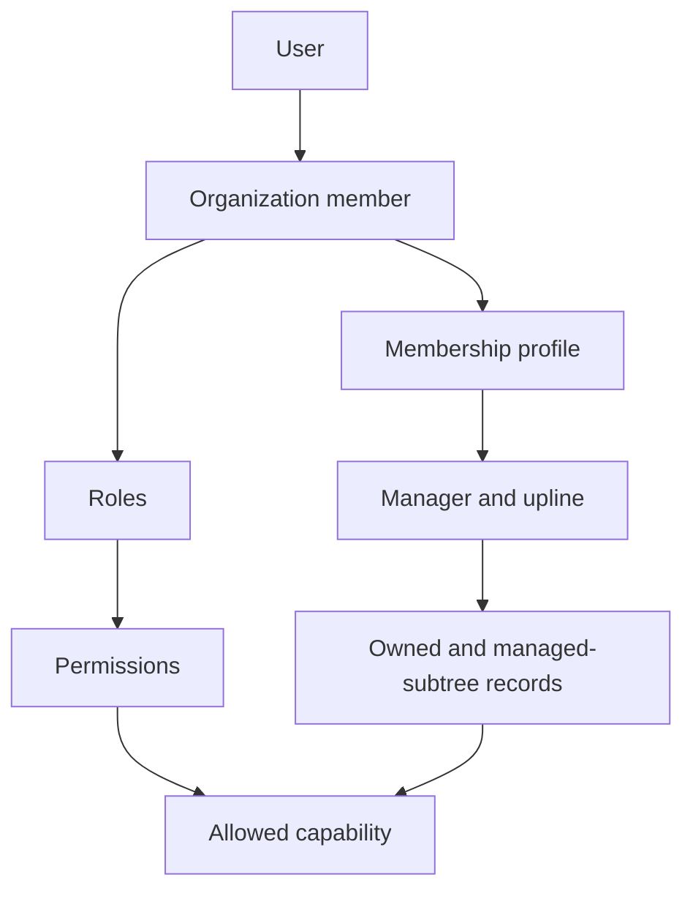

| Attribute | Value |
| --- | --- |
| Core route | `/team` |
| Advanced route | `/team/roles` |
| Optional expansion | `advancedRoles` |
| Main tables | `roles`, `permissions`, `role_permissions`, `membership_profiles`, `member_roles` |
| Permissions | `tenant.manage_users`, `tenant.manage_roles`, `records.view_all`, `records.manage_all` |
| Primary code | `app/(app)/team/`, `lib/permissions.ts`, `lib/access-scope.ts`, `db/schema/rbac.ts` |

## Access model

Authorization combines:

1. Active organization membership.
2. Software-defined permission keys.
3. Role grants.
4. Ownership and manager/upline record scope.
5. Seniority tier for stage-approval behavior.
6. Optional all-record elevation.

## Core versus Advanced Roles

| Core | `advancedRoles` enabled |
| --- | --- |
| Fixed role templates and assignment. | Create, edit, and delete custom roles. |
| Simple reporting line. | Edit granular permission matrices. |
| Permission engine always runs. | Edit richer role and seniority configuration. |

The flag gates the advanced editor, not the permission engine or stored grants.

## Default roles

Owner and Admin have full control. Manager can approve and manage broader
records. Senior Rep can advance stages without the lower-tier approval gate.
Rep performs day-to-day selling with gated advances. Viewer is read-only.

## Code map

| Layer | Location |
| --- | --- |
| Team and role UI/actions | `apps/web/app/(app)/team/` |
| Permission catalog and templates | `apps/web/lib/permissions.ts` |
| Request context | `apps/web/lib/auth-context.ts` |
| Record scoping | `apps/web/lib/access-scope.ts` |
| Tenant transaction wrapper | `apps/web/lib/actions.ts`, `db/tenant.ts` |
| Schema | `apps/web/db/schema/rbac.ts`, `auth.ts` |
