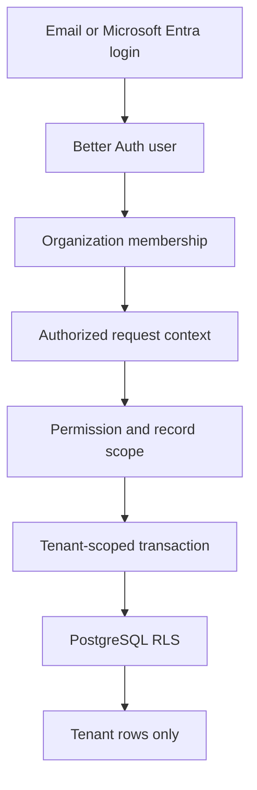

Tenancy and authentication are platform foundations rather than sidebar
modules. Every product action depends on them.

## Defense layers

1. Better Auth establishes identity and active organization.
2. Request context resolves membership, roles, permissions, and reporting line.
3. `withTenant` or `withModule` checks the required capability.
4. A transaction sets `app.current_tenant`.
5. PostgreSQL RLS filters and protects rows.
6. Tenant-safe composite foreign keys prevent cross-tenant relationships.

Middleware redirects are convenience only. Server actions, route handlers, and
RLS remain authoritative.

## Create a customer organisation

Superadmin only: open the organisation switcher → **Create customer
organization**. Enter name/code; initial users are optional and consume entitled
seats when active. The action seeds tenant defaults, roles, permissions, settings,
and the owner membership in one transaction. Other users must be invited through
**Team & roles**.

This CRM tenant is separate from control-plane client/organisation metadata.
Commercial dates, seats, modules, and deployment status still come from the
vendor-signed entitlement.

## Code map

| Layer | Location |
| --- | --- |
| Better Auth configuration | `apps/web/lib/auth.ts` |
| Client integration | `apps/web/lib/auth-client.ts` |
| Request context | `apps/web/lib/auth-context.ts` |
| Action wrappers | `apps/web/lib/actions.ts` |
| Tenant DB transaction | `apps/web/db/tenant.ts` |
| RLS installation | `apps/web/db/sql/rls.sql` |
| Auth and RBAC schema | `apps/web/db/schema/auth.ts`, `rbac.ts` |

## Extension rule

Every new server action or HTTP endpoint must declare its permission and enter a
tenant-scoped transaction before reading or writing business data.
