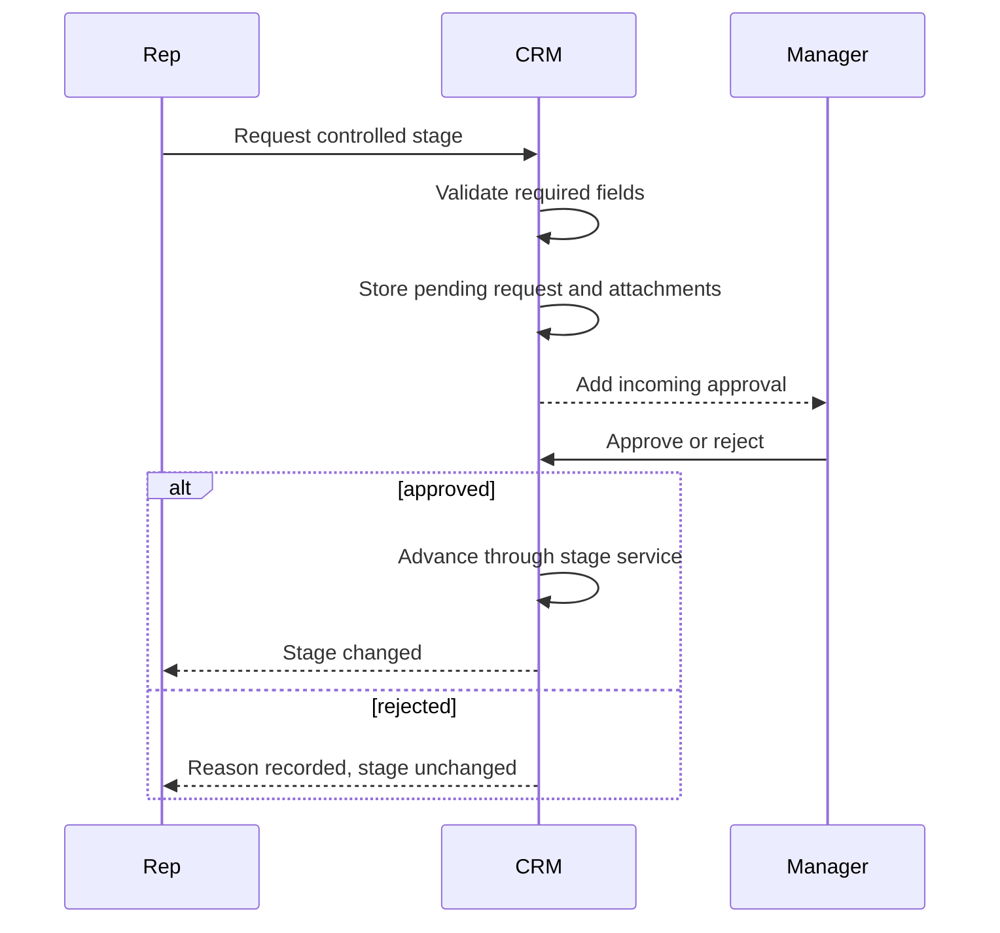

| Attribute | Value |
| --- | --- |
| Availability | Core |
| Route | `/approvals` |
| Main tables | `stage_approval_requests`, `attachments` |
| Permissions | `stage.advance`, `stage.advance.approve` |
| Primary code | `app/(app)/approvals/`, `server/services/stage.ts`, `db/schema/approvals.ts` |

## Purpose

Approvals prevent lower-tier users from moving a funnel into a controlled stage
without an explicit reason, evidence, and authorized upline decision.

## Invariants

- The stage never moves optimistically.
- The same stage validation runs after approval.
- A request records requester, target stage, reason, evidence, reviewer,
  decision, and timestamps.
- Seniority tier decides whether approval is required, while permissions decide
  whether a user can advance or approve.
- Approved movement is recorded with `approval` as its change source.

## Code map

| Layer | Location |
| --- | --- |
| Inbox and “my requests” UI | `apps/web/app/(app)/approvals/` |
| Request and decision actions | `apps/web/app/(app)/approvals/actions.ts` |
| Authoritative transition | `apps/web/server/services/stage.ts` |
| Schema | `apps/web/db/schema/approvals.ts` |
