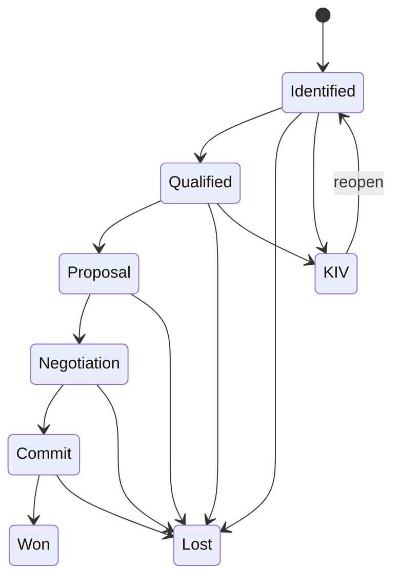

| Attribute | Value |
| --- | --- |
| Availability | Core |
| Route | `/funnel`, `/funnel/[id]` |
| Main tables | `funnels`, `pipelines`, `pipeline_stages`, `funnel_stage_history` |
| Permissions | `opportunity.*`, `stage.advance`, `stage.advance.approve`, `funnel.manage` |
| Primary code | `app/(app)/funnel/`, `server/services/stage.ts`, `lib/funnel-stages.ts`, `lib/stage-gate.ts` |

## Purpose

A funnel is one commercial deal under an Opportunity. It carries estimated
amount, stage, dates, status, renewal and intercompany context, quotations, and
payment milestones.

## Default ladder

| Code | Default label | Probability | Kind |
| --- | --- | ---: | --- |
| `0e` | Identified | 0% | Open |
| `1d` | Qualified | 25% | Open |
| `2c` | Proposal | 50% | Open, approval by default |
| `3b` | Negotiation | 75% | Open, approval by default |
| `4a` | Commit | 90% | Open, approval by default |
| `won` | Closed Won | 100% | Won, approval by default |
| `lost` | Closed Lost | 0% | Lost |
| `kiv` | Keep In View | 0% | Parked |

Stage semantics use `code` and `kind`, never editable display names. Required
fields, forecast inclusion, probability, order, and approval requirements are
tenant-configurable.

## Side effects

- Entering Commit or Won can seed payment milestones.
- Winning turns a prospect account into a customer.
- Quote acceptance can advance the funnel through the same stage service.
- Finance-enabled intercompany deals synchronize partner-side context.
- Every movement writes immutable stage history and activity.

## Code map

| Layer | Location |
| --- | --- |
| UI and actions | `apps/web/app/(app)/funnel/` |
| Stage state machine | `apps/web/server/services/stage.ts` |
| Default stages | `apps/web/lib/funnel-stages.ts` |
| Entry requirements | `apps/web/lib/stage-gate.ts` |
| Schema | `apps/web/db/schema/pipeline.ts` |
| API | `GET /api/v1/funnels`, `GET /api/v1/funnels/{id}` |
