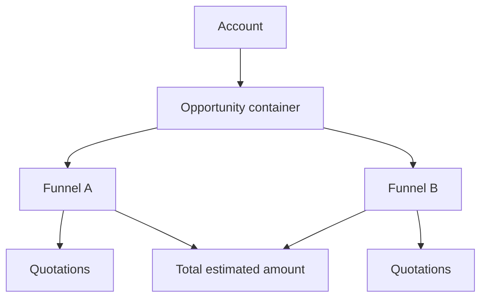

| Attribute | Value |
| --- | --- |
| Availability | Core |
| Route | `/opportunities`, `/opportunities/[id]` |
| Main table | `opportunities` |
| Permissions | Uses the `opportunity.*` permission family |
| Primary code | `app/(app)/opportunities/`, `server/services/opportunity-container.ts`, `db/schema/pipeline.ts` |

## Purpose

An opportunity is the parent pursuit. It belongs to an account, has an owner and
stakeholders, stores PPVVC analysis, budget and project-nature context, and
rolls up the estimated value of its child funnels.

## Opportunity versus funnel

| Opportunity | Funnel |
| --- | --- |
| Describes the overall pursuit. | Describes one deal moving through stages. |
| Owns account-level analysis and stakeholders. | Owns stage, amount, dates, outcome, and quotes. |
| Can contain several funnels. | Belongs to one opportunity. |
| Rolls up child estimates. | Contributes its estimate to the parent. |

## Responsibilities

- Generate a tenant/year-scoped opportunity code.
- Hold account, primary contact, owner, sponsor, budget, and PPVVC data.
- Cascade shared analysis and project nature to child funnels.
- Recompute total estimated funnel amount when children change.
- Provide the stable container used by lead conversion.

## Code map

| Layer | Location |
| --- | --- |
| UI and actions | `apps/web/app/(app)/opportunities/` |
| Container rules | `apps/web/server/services/opportunity-container.ts` |
| Numbering | `apps/web/server/services/numbering.ts` |
| Schema | `apps/web/db/schema/pipeline.ts` |
| API | `GET /api/v1/opportunities`, `GET /api/v1/opportunities/{id}` |
