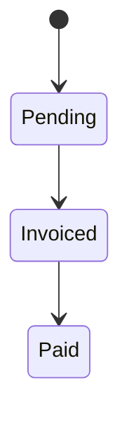

| Attribute | Value |
| --- | --- |
| Availability | Core |
| Route | `/payment-milestones`, `/payment-milestones/[id]` |
| Main table | `payment_milestones` |
| Permissions | `payment_milestone.view`, `payment_milestone.manage` |
| Primary code | `app/(app)/payment-milestones/`, `db/schema/billing.ts` |

## Purpose

Payment milestones express when and how much the business expects to invoice.
They remain core because they can belong directly to a Funnel, even when the
Projects plugin is disabled.

## Responsibilities

- Attach to a Funnel, a Project, and optionally a Quotation.
- Record title, amount, due date, product category, and expected invoice period.
- Seed default milestones when a Funnel reaches Commit or Won.
- Reorder and split milestones while preserving the total.
- Prevent project allocations from exceeding project value.
- Link an issued invoice and later receipt through Finance.

## Code map

| Layer | Location |
| --- | --- |
| Cross-funnel UI | `apps/web/app/(app)/payment-milestones/` |
| Project milestone UI and actions | `apps/web/app/(app)/projects/actions.ts` |
| Core actions | `apps/web/app/(app)/payment-milestones/actions.ts` |
| Auto-create trigger | `apps/web/lib/stage-gate.ts`, `apps/web/server/services/stage.ts` |
| Schema | `apps/web/db/schema/billing.ts` |

## Boundary rule

Milestones describe expected billing. Invoices, receipts, purchase invoices,
and payments are Finance documents and must not be added to this table.
