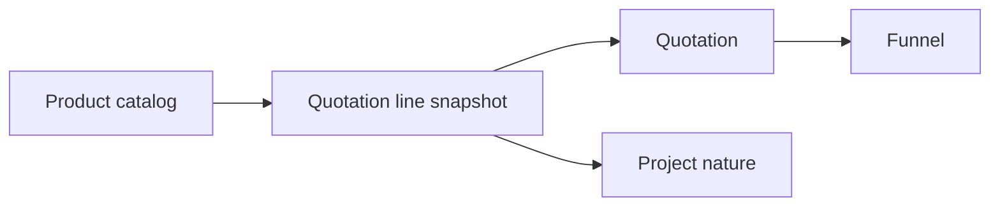

| Attribute | Value |
| --- | --- |
| Availability | Core |
| Route | `/products`, `/products/[id]` |
| Main table | `products` |
| Permissions | `product.view`, `product.create`, `product.update`, `product.delete` |
| Primary code | `app/(app)/products/`, `db/schema/products.ts` |

## Purpose

Products provide a standardized catalog for quotation lines. A quotation line
may link to a product while retaining its own description, quantity, price,
unit, discount, tax, and project-nature snapshot.

## Responsibilities

- Maintain reusable product names, codes, units, categories, and pricing data.
- Prefill quotation lines without forcing every line to remain catalog-bound.
- Show linked deals and usage history.
- Soft-delete discontinued products without invalidating historical quotes.
- Support product and project-nature reporting.

## Relationship

## Code map

| Layer | Location |
| --- | --- |
| UI and actions | `apps/web/app/(app)/products/` |
| Schema | `apps/web/db/schema/products.ts` |
| Quote integration | `apps/web/app/(app)/quotations/actions.ts` |
| Settings taxonomy | `apps/web/app/(app)/settings/taxonomy/product-codes/` |

## Extension rule

Product catalog values are reusable defaults. Commercial snapshots must remain
on the quotation line so later catalog edits cannot rewrite an issued offer.
