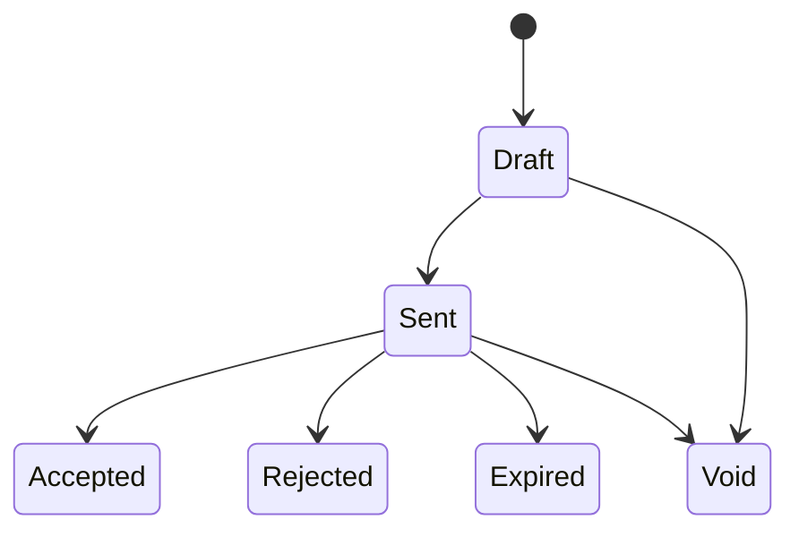

| Attribute | Value |
| --- | --- |
| Availability | Core |
| Route | `/quotations`, `/quotations/[id]`, `/quotations/[id]/preview` |
| Main tables | `quotations`, `quotation_line_items`, `tax_settings` |
| Permissions | `quotation.*`, `tax.view`, `tax.configure` |
| Primary code | `app/(app)/quotations/`, `server/services/quotation-math.ts`, `server/services/quote-sync.ts` |

## Purpose

A quotation is a priced offer under a Funnel. It snapshots the tax and
commercial facts required to keep sent and accepted versions historically
correct.

## Commercial model

- One Funnel can have many quotation versions.
- At most one live primary quotation and one live accepted quotation exist per
  Funnel, enforced by database indexes.
- Lines can use catalog Products or free-form service descriptions.
- Quantity, unit price, absolute line discount, header discount, tax, and totals
  are computed centrally.
- Tax rate and tax-inclusive mode are snapshotted so later settings changes do
  not alter issued documents.
- Acceptance can move the Funnel and can create a Project when that plugin is
  enabled.

## Code map

| Layer | Location |
| --- | --- |
| List, editor, detail, print preview | `apps/web/app/(app)/quotations/` |
| Server actions | `apps/web/app/(app)/quotations/actions.ts` |
| Calculation rules | `apps/web/server/services/quotation-math.ts` |
| Quote and funnel synchronization | `apps/web/server/services/quote-sync.ts` |
| Numbering | `apps/web/server/services/numbering.ts` |
| Schema | `apps/web/db/schema/quotations.ts` |
| API | `GET /api/v1/quotations`, `GET /api/v1/quotations/{id}` |

## Tax ownership

Tax administration lives under Settings → Billing → Tax. The legacy
`/tax-settings` route is not a separate module.
